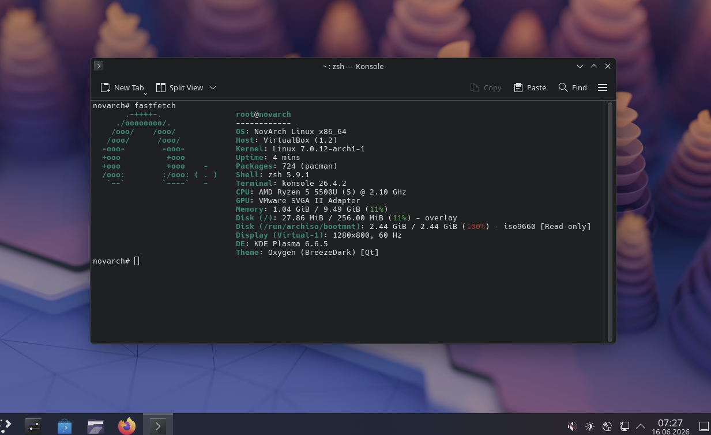

# NovArch Linux

> A ready-to-use Arch-based distribution focused on simplicity, performance, and customization.

  

## Why NovArch?

NovArch provides a fully functional KDE Plasma desktop out of the box while remaining close to Arch Linux principles.

Instead of spending hours configuring a new installation, users get a clean, lightweight system that is ready for daily use and development.

## Features

| | |
|---|---|
| 🖥 Desktop | KDE Plasma |
| 📦 Package Base | Arch Linux |
| ⚡ Performance | Lightweight configuration |
| 🛠 Installer | Calamares |
| 🚫 Bloat | Essential applications only |
| 🎨 Customization | Fully user-controlled |

## Philosophy

NovArch is not designed to replace Arch Linux.

Its goal is to provide a streamlined starting point while preserving the freedom to modify every aspect of the system.

## Ideal For

- New Arch users
- Developers
- KDE enthusiasts
- Customization-focused users
- Daily desktop usage

## Roadmap

- [ ] First public ISO
- [ ] Website release
- [ ] Automated CI builds
- [ ] Documentation portal

## Contributing

Contributions, bug reports, and suggestions are welcome.
